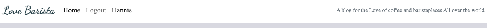
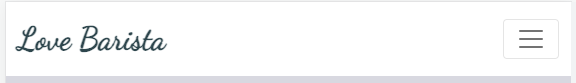

# Love Barista

[Live Site](https://8000-hannaberggr-lovebarista-4l76yoe8zfr.ws-eu101.gitpod.io/)

## Table Of Contents:
1. [Project Goals](#project-goals)
    * [CRUD functionality](#crud-functionality)
2. [UX Design](#ux-design)
    * [User Stories](#user-stories)
    * [Wireframes](#wireframes)
    * [Agile Methodology](#agile-methodology)
    * [Typography](#typography)
    * [Color Scheme](#color-scheme)
    * [Database Diagram](#database-diagram)    
3. [Features](#features)
    * [Navigation Bar](#navigation-bar)  
    * [Home Page](#home-page)
    * [Register Page](#register-page)
    * [Create Blogpost](#create-blogpost)
    * [Login Page](#login-page)
    * [Logout Page](#logout-page)
    * [Comment Page](#comment-page)
    * [Liked Comment](#liked-comment)
    * [Edit Page](#edit-page)
    * [Delete Page](#delete-page)
    * [Footer](#footer)

4. [Future Features](#future-features)
5. [Technologies Used](#technologies-used)
6. [Testing](#testing)
7. [Bugs](#bugs)
8. [Fixed Bugs](#fixed-bugs)
7. [Deployment](#deployment)
8. [Credits](#credits)
9. [Acknowledgements](#acknowledgements)

### Project goals

* This site is created with the intention to help the coffee lovers around the world to share their passion for coffee. They should be able to view and change the blogpost if they think it should be neccessary.

### First time user goals
* As a first time user I want the navigation to be simple
* As a first time user I want the registration to be simple
* As a first time user I want the login to be simple
* As a first time user I want the logout to be simple
* As a first time user I want to easily understand how to change/delete my blogpost

### CRUD functionality

Love Barista features a data store with full Create, Read, Update and Delete functionality.

- Create - users can create a user account and create a blogpost.
- Read - users can view the posts of other users. Authenticated users can read comments about all blogposts.
- Update - authenticated users can update their blogpost and save the changes.
- Delete - authenticated users can delete their blogpost.

## UX Design:

### Wireframes
Wireframes was created in [Balsamiq](https://balsamiq.com/) for this project and are displayed below. The wireframes were  created in the planning phase of the project. Please note that changes have been made during the course of the work.

### User Stories
After the first planning phase user stories were implemented one by one. The wireframes created became the base for the User stories. 

The user stories that where created can be found [here](https://github.com/users/HannaBerggren/projects/6/views/1)

### Agile Methodology
GitHub issues, milestones and projects were used to document and track an agile development approach.
An issue was created for each user story. All user stories were then added to a 'Product Backlog' milestone [Link to product backlog](https://github.com/HannaBerggren/Love-Barista/milestone/1).

I set up a plan for development and this was performed to see how it would work in real life. A milestone and a GitHub project board (a Kanban board) were created for each iteration, and user stories moved from the Product Backlog and into iterations as each cycle of work began. They were labelled as 'must have' goals for the iteration and assigned story point values.

A project Kanban board was used to track progress, with user stories moved between 'Todo', 'In Progress' and 'Done' columns as appropriate. 

### Typography

[Google Fonts](https://fonts.google.com/) was used to import the fonts featured in the site, my logo is in dancing script and the rest of the text is in el-messiri.

### Icons and Images

* All icons used throughout the site were provided by [Font Awesome](https://fontawesome.com/)
* I sourced an icon from [Flaticon](https://www.flaticon.com). And then I used [Favicon](https://favicon.io/) to convert this png to an icon file and imported that to my site. I installed a Favicon to help users clarify this tab from others in their browser, a coffee-related design and with hearts because it felt like fun.

### Color Scheme

* I chose colors from the design image, with some changes along the way to get a clean and calm feeling. 

I used [Coolors](https://coolors.co/) to generate a color scheme from the default post image. I chose a natural background color with complimentary colors in green, blue and orange for text, buttons and icons to make the sites content stand out to be clear to the user.

### Database Diagram

I created an entity relationship diagram using LucidCharts.

### Design Image

## Features:

### Navigation Bar

- The Navigation bar sits at the very top of each page, The logo is at the left hand side and the navigation links are next to it, a short summary of the page is about is written on the right.
- When logged in the **Login** becomes **Logout** and the **Registeration** link is removed.
- The Navbar background is white with the Navigation links and logo in black and darkgreen colored text.
- When the logo is clicked it redirects the user to the home page.
- On large to xx-large screens the navigation bar covers the entire page.
- When on medium to small screens the navigation menu changes to burger menu which shows all the nav links when clicked on (see the two screenshots below).

Navigation bar on mobile and tablets

### Home Page

* The Home page introduce the user to the blog by showing different blogposts. It's easy to click on every blogpost to read more about a place the viewer finds interesting.

### Register page

* Makes it available for a new user to create an account, you have to have an account to be able to make a blogpost.

### Create blogpost

* After you have register, when you click on your name in the navbar, you
can choose between the create blogpost page or the manage blogpost page.
* Create a blogpost offers the user to easily add content and upload a picture when they want to make their post.

### Login page

* This page is where the user can log in. 

### Logout page

* This page is where the user can log out.

### Comment page

* This page is where the user can make a comment.

### Liked comment

* A number of likes and how many comments a post have is showing like this:

### Edit Page

### Delete Page

### Footer

- The footer is found at the bottom of every page and is responsive for small and large screens.
- The footer displays author and icons for Facebook, Twitter, Instagram and Google. These are all in different colours to pop out to get the viewers interest.
- When any of the icons are clicked the social media site opens on a seperate tab, this way the user still has the Love Barista website open so they can easily navigate back to it.

### Future features

* I would like to add a map function to point out where the location of the coffeeplaces is.
* I would like to add a "cancel" button next to the "delete" button if the user change their mind about deleting a post. 
* I would like to spend more time on the styling and make sure it looks even better.

## Technologies used

* [GitHub](https://github.com/) - to host the repositories
* [Gitpod](https://www.gitpod.io/) - as the IDE for the application
* [Elephantsql](https://www.elephantsql.com/) - for the postgresql
* [Python](https://docs.python.org/3/contents.html) - primary language of the application.
* [HTML](https://www.w3schools.com/html/) - Structure/skeleton of the page
* [CSS](https://www.w3schools.com/css/) - extra styling of the webpage
* [Stack overflow](https://stackoverflow.com/) - basic explaining 
* [Bootstrap 5](https://www.w3schools.com/bootstrap5/bootstrap_get_started.php) - for design and placement
* [PEP8](http://pep8online.com/) - for testing and validating the code.
* [Google Fonts](https://fonts.google.com/about) - for the font of the text
* [Pexels](https://www.pexels.com/sv-se/) - for pictures for the site
* [Google](https://www.google.com) - for pictures for the site
* [Coolors](https://coolors.co/) - for the coloring of the page
* [Hostinger](https://www.hostinger.com/) - for adding favicon
* [Flaticon](https://www.flaticon.com/) - for finding favicon
* [Favicon](https://favicon.io/) - to generate the favicon and making download
* [Markdown](https://www.markdownguide.org/) - for writing README.md and TESTING.md file

## Testing

Please click [**_here_**](TESTING.md) to read more information about testing Love Barista.

Admin Page
* Admin has access via the default Django Admin page. The Admin login can be accessed from the navigation menus once a superuser has logged in. Once logged in, Admin users have all the access to create, edit and delete all posts. All the requests can be viewed from the admin page.

## Bugs

* None that I'm aware of

## Fixed bugs

* Had trouble getting the delete/update buttons to appear, but solved it when I realized I forgot to write the code for the buttons.

## Deployment

### [Elephantsql](https://www.elephantsql.com/) 

* Heroku needs sql's to work
* ElephantSQL will manage administrative tasks of PostgreSQL, such as installation, upgrades to latest stable version and backup handling.
* It automates every part of setup and running of PostgreSQL clusters.

1. Log into Heroku 
The first step to creating a free PostgreSQL database is to log in to Heroku. To create a new database on Heroku, an app must first be created within the personal dashboard. 

2. Create a new Heroku app 
Once logged in to Heroku, navigate to the personal app dashboard to create a new Heroku app. Simply click the Create new app button, which should be located on the top-right corner of the dashboard. 

3. Add a PostgreSQL database 
After creating the new app, it's time to attach a PostgreSQL database to it. Simply navigate to the Resources tab located in the header of the app's dashboard. Add the ElephantSql and a free PostgreSQL database has now been successfully created. 

### [Github](https://github.com/) 

* When logging into github, navigate to the settings tab
* Here you can find pages down on the left side
* A new page will load which will present the branch to master or main, and then the save option
* Once the save button has been clicked and the page is reloaded there will be a link to the deployed site.

### [Heroku](https://www.heroku.com/) Deployment:

* Ensure your requirements.txt file has the required dependencies. To do this you can use the following
code in your IDE: pip3 freeze > requirements.txt
* Create or login to you Heroku account
* Navigate to Dashboard
* Click and select "Create app" in the middle of the page
* Enter a unique name for you app
* Select region and the "create app"

### App deployment
* Navgiate to the deploy section
* Scroll down to the "deployment method" and select "Github"
* Authorise the connection
* Also important to make sure you have the right config variables applied, these change the way the app behaves. 
* Go to the settings tab and then click reveal config vars
* Add the following config vars:
* * SECRET_KEY: (Your secret key)
* * DATABASE_URL: (This should already exist with add on of postgres)
* * EMAIL_HOST_USER: (email address)
* * EMAIL_HOST_PASS: (email app password)
* * CLOUNDINARY_URL: (cloudinary api url)
* Search for the repository name you've chosen
* Make sure you have selected the correct branch (master/main), and select the method you desire.

## Credits 

### Content

* I used Code Institute's I Think Therefore I Blog (walkthrough project) for guidance with code structure and deployment steps. It was really helpful and helped me alot along the way.

### Acknowledgements
* This Love Barista Blog was created as Portfolio Project 4 for the the Full Stack Software Developer diploma by the [Code Institute](https://codeinstitute.net/).
* I would like to thank the tutors at Code Institute for being very helpful 
* My partner who helped me with mental support. 
* And once again, thanks to my cousin for helping me with so many things!

Hanna Berggren, 2023
