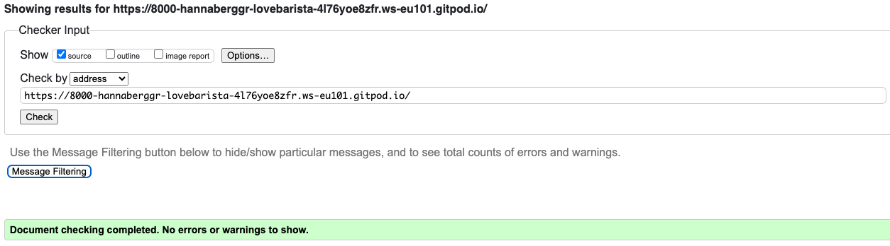

# **Love Barista** - Frontend Testing

## Table Of Contents:
1. [Validator Testing](#vadilidator-testing)
    * [CSS](#css)
    * [Html](#html)
    * [JavaScript](#javascript)
    * [Python](#python)
    * [Lighthouse](#lighthouse)
2. [User Story Testing](#user-story-testing)
3. [Responsiveness Testing](#responsiveness-testing)
4. [Browser Compatibility](#browser-compatibility)
4. [Manual Testing](#manual-testing)

## Validator Testing

### CSS
- The CSS stylesheet was put through the [W3C validator](https://jigsaw.w3.org/css-validator/)  to check for errors.
- No errors were found.

  

### HTML
The site pages were run through the [W3C validator]([https://validator.w3.org/](https://validator.w3.org/nu/?showsource=yes&doc=https://8000-hannaberggr-lovebarista-4l76yoe8zfr.ws-eu101.gitpod.io/)) to check for any issues and HTML syntax errors. 

No errors were to be found.

### JavaScript
- The Javascript file was put through the [Jshint](https://jshint.com/) to check for errors. 
- No errors, but five warnings was found.

### Python

- The code was tested to check for errors using **Code Institutes pep8 online** website, [PEP8](https://pep8ci.herokuapp.com/). No errors returned as you can see from the screenshots below.

    
admin.py
  
    
  

  

    
forms.py
  
    
  

  

    
models.py
  
    

  
  

    
urls.py
  
    

  

    
views.py
  
    

  

[Back to the top](#table-of-contents)
- - - 
### Lighthouse

* This is four different reads from lighthouse:

---
[Back to the top](#table-of-contents)

## User Story testing

#### Navigation

 - The Navigation at the top of the page makes it easy for the user to navigate.

#### Register

 - In the Navigation bar at the top of the page, if a User clicks on the Register link, they will be brought to the registration page where they can sign up, once they sign in they will be able to access full functionality of the site.
 
#### Signin | Signout

 - When a User is not logged in the login link will be visible in the navigation bar, the same link will change to log out when the user is logged in.
 - When the User enters their login credentials they will be able to access full fuctionality of the site. When the user is logged out they will not have full access on the site and their account will be secure.

#### View a Post

- A logged in user is able to click on a post and this will take them to the post page where they can view the post more closely. If they want, they can write a comment about the post.
- If a user isn't logged in they can click on a post, but the field to write a comment is not showing.

#### Add a Post

- When a user is signed in they are able to click on the Add Post button at the Post page, which will bring them to the Add Post page where they can upload their post.

#### Edit | Delete a Post

- When viewing a post that the User has uploaded, they have a choice to either delete or edit the post. A user can only edit or delete a post that they own.

#### Like | Unlike posts

- On the post details there is a like button below the image, it's a heart that is empty outline when not liked and it's gets populated when someone clicks on it. A User must be logged in to access this functionality.

#### Add comments

- When a user is signed in and they are on the post details page for a particular post, at the bottom of the page there is a comment section where they can add a comment.

---
[Back to the top](#table-of-contents)

### Responsiveness testing

The responsive design tests were carried out manually throughout the build using Google Chrome Dev Tools. 

During the testing process I also used the [Responsive Design Checker](https://www.responsivedesignchecker.com/) website to simulate the website on several other devices. Here are my results:

### Mobile Devices

||
iPhone 6/6s/7

375 x 667
|
Samsung Galaxy S5/6/7

360 x 640
|
Google Pixel/Nexus 5

411 x 731
|
| :- | :-: | :-: | :-: |
|Render|Pass |Pass|Pass|
|Images|Pass|Pass|Pass|
|Links|Pass|Pass|Pass|

### Tablet Devices

||
Amazon Kindle Fire

768 x 1024
|
Samsung Galaxy Tab 10

800 x 1280
|
Apple iPad Pro

1366 x 1024

|
| :- | :-: | :-: | :-: |
|Render|Pass|Pass|Pass |
|Images|Pass|Pass|Pass|
|Links|Pass|Pass|Pass|

### Desktop Devices

||
24“ Desktop

1920 x 1200
|
19” Desktop

1440 x 900
|
10” Notebook

1024 x 600
|
| :- | :-: | :-: | :-: |
|Render|Pass|Pass|Pass|
|Images|Pass|Pass|Pass|
|Links|Pass|Pass|Pass|

### Browser Compatibility 

Love Barista was tested on the following browsers:

- Google Chrome
- Mozilla Firefox

Appearance and functionality appear to be consistent throughout all browsers.

---
[Back to the top](#table-of-contents)

## Manual Testing

Admin Page
* Admin has access via the default Django Admin page. 
* The Admin login can be accessed from the navigation menus once a superuser has logged in. Once logged in, Admin users have all the access to create, edit and delete all posts. 
* All the requests can be viewed from the admin page.

Users
* If the user try to create a account, a text is shown if they havn't filled in the form correct.
* It's not possible to add a post unless the user has an account.
* The user can like all blogposts if they have an account and are logged in.
* The user can only delete/edit their own blogpost.

### Navigation
| Feature               | Test Performed                                                        | Result  |
|-----------------------|-----------------------------------------------------------------------|---------|
| Logo    | Clicking on the logo redirects the user to home page.                               | Pass    |
| Register | When signed out clicking on the Register link, brings the user to the registration page.                                                                             | Pass    |
| Login | When signed out, clicking on the Login link, brings the user to the login page.       | Pass    |
| Logout | When signed in, clicking on the logout link, brings the user to the logout page.     | Pass    |
| Correct links display | When a user is signed in or out the correct links display for both.   | Pass    |
| Responsiveness | Checked to make sure it changes to burger menu on smaller devices.           | Pass    |

### Footer
| Feature               | Test Performed                                                        | Result  |
|-----------------------|-----------------------------------------------------------------------|---------|
| External links | Clicking on social media links opens on a new page.                          | Pass    |
| Displays correctly on all pages | Made sure it displays correctly on all pages.               | Pass    |
| Responsiveness | Checked to make sure link icons display correctly on smaller devices.        | Pass    |

### Home
| Feature               | Test Performed                                                        | Result    |
|-----------------------|--------------------------------------------------------------------|-----------|
| Responsiveness | The page is responsive on several different devices, browsers and screen widths. | Pass      |
| Blog Posts | Checked to make sure images loads correctly.                  | Pass      |

### Posts
| Feature               | Test Performed                                                     | Result    |
|-----------------------|--------------------------------------------------------------------|-----------|
| Responsiveness | The page is responsive on several different devices, browsers and screen widths. | Pass      |
| Posts   | Posts cards displays as expected.                                        | Pass      |
| Add post/view old post buttons | An Add Post/view old post buttons is being displayed when the user is signed in.   | Pass      |
| 6 Posts Per Page | Not more than 6 posts per page is being displayed.                  | Pass      |
| Next button | A next button at the bottom of the page is being displayed if there is more than six recipes being displayed.      | Pass      |
| Back button | A back button at the bottom of the page is being displayed if the user is on the next recipe page. | Pass      |

### Post Details Page
| Feature               | Test Performed                                                     | Result    |
|-----------------------|--------------------------------------------------------------------|-----------|
| Responsiveness | The page is responsive on several different devices, browsers and screen widths. | Pass      |
| Post Content   | The post content displays as expected.                                | Pass      |
| Edit Post   | If the user is the owner of the post they can click the edit button to edit their post. | Pass      |
| Delete Post | If the user is the owner of the post they can click the delete button to delete their post. | Pass      |
| Signed in user access | Only singed in users can access the full detail page.           | Pass      |
| Like button   | A clickable like button is being displayed below the post.               | Pass      |
| Display total number of likes   | Displays the number of users that have liked the post. | Pass      |
| Comment Section  | Displays comments added to the comment section.                         | Pass      |
| Post Comment   | Allows users to post a comment and display it in the comment section.     | Pass      |

### Add A Post Page
| Feature               | Test Performed                                                     | Result    |
|-----------------------|--------------------------------------------------------------------|-----------|
| Responsiveness | The page is responsive on several different devices, browsers and screen widths. | Pass      |
| Display form  | Every input field is displaying on the add a post form.                 | Pass      |
| Submit filled out form  | A user can fill out the form and click the submit button at the bottom of the page. | Pass      |
| Leave Image field blank on submission  | If the user leaves the image field blank the place holder image displays after submitting. | Pass      |
| Leave Input fields blank | The form won't submit if the user leaves required input fields blank, warnings will be displayed for the user. | Pass      |
| Submit Button | On click it will submit the post, and bring the user to the posts page where the newly added post can be seen. | Pass      |
| Clicking arrow back | When the user clicks arrow back the user comes back to the previous page.    | Pass      |
| Success Message | Success message is displayed at the top of the screen when a user clicks Submit.  | Pass      |

### Update A Post Page
| Feature               | Test Performed                                                     | Result    |
|-----------------------|--------------------------------------------------------------------|-----------|
| Responsiveness | The page is responsive on several different devices, browsers and screen widths. | Pass      |
| Display form  | All the input fields displays with the orginal post.                                  | Pass      |
| Update form  | When a user updates a post and clicks the submit button at the bottom of the page the post updates. | Pass      |
| Update Button | On click it, updates the post, and brings the user to the posts page where the updated post can be seen. | Pass      |
| Clicking arrow back | When the user clicks arrow back the user comes back to the previous page.    | Pass      |
| Success Message | A success message is displayed at the top of the screen when a user clicks update.  | Pass      |

### Delete A Post
| Feature               | Test Performed                                                     | Result    |
|-----------------------|--------------------------------------------------------------------|-----------|
| Responsiveness | The page is responsive on several different devices, browsers and screen widths. | Pass      |
| Delete Button | When the user clicks the Delete button the post will be deleted.                 | Pass      |
| Clicking arrow back | When the user clicks arrow back the user comes back to the previous page.    | Pass      |
| Success Message | A success message is displayed at the top of the screen when a user clicks on delete.  | Pass      |

### Register Page
| Feature               | Test Performed                                                     | Result    |
|-----------------------|--------------------------------------------------------------------|-----------|
| Responsiveness | The page is responsive on several different devices, browsers and screen widths. | Pass      |
| Sign In link | Under the "already have an account section", the Sign in link redirects the user to the Login Page | Pass      |
| Submit Filled Out Form  | When the user fills out the sign up form and clicks the Signup button a new account is created. | Pass      |
| Leave Email Field Blank  | When the user fills out all the fields in the form except the optional email field and clicks submit a new account is created. | Pass      |
| Leave Username Field Blank| When the user fills out the form and leaves Username field blank, a warning messages appeare saying that the field most not be left blank, Sign Up is not approved.| Pass      |
| Leave Password Field Blank| When the user fills out the form and leaves Password field blank, a warning messages appeare saying that the field most not be left blank, Sign Up is not approved.| Pass      |
| Leave Password (again) Field Blank| When the user fills out the form and leaves Password (again) field blank, a warning messages appeare saying that the field most not be left blank, Sign Up is not approved.| Pass      |
| Signup with an already taken username| When the user register an account that already has the taken username, the sign upp fails and a warning messages appeare saying that a user with that username already exists. | Pass      |
| Signup Button | On click the signup button will submit the user details, log them in and redirect them to the home page. | Pass      |
| Success Message | Success message is displayed at the top of the screen when a user enters the correct details and clicks Sign Up. | Pass      |

### Login Page
| Feature               | Test Performed                                                     | Result    |
|-----------------------|--------------------------------------------------------------------|-----------|
| Responsiveness | The page is responsive on several different devices, browsers and screen widths. | Pass      |
| Sign Up link | Under the "if you do not have an account" section, the Sign up link redirects the user to the Register Page        | Pass      |
| Leave Username Field Blank| When the user fills out the form and leaves Username field blank, a warning messages appeare saying that the field most not be left blank, Sign In is not approved.| Pass      |
| Leave Password Field Blank| When the user fills out the form and leaves Password field blank, a warning messages appeare saying that the field most not be left blank, Sign In is not approved.| Pass      |
| Sign In with unregistered account | If a User tries to sign in with an account that is not registered, a warning messages appeare saying that 'the username and/or password you specified are not correct'. The sig in will not be approved. | Pass      |
| Sign In Button | On click it will sign in the user if they have entered the right credentials. The user will get redirect to the home page. | Pass      |
| Success Message | Success message is displayed at the top of the screen when a user enters the correct credentials and clicks Sign in. | Pass      |

### Logout Page
| Feature               | Test Performed                                                     | Result    |
|-----------------------|--------------------------------------------------------------------|-----------|
| Responsiveness | The page is responsive on several different devices, browsers and screen widths. | Pass      |
| Sign Out Button | When you click sign out button, the user is signed out and redirect to the login page.  | Pass      |
| Success Message | Success message is displayed at the top of the screen after clicking Sign Out to let the user know they have logged out. | Pass      |

---
[Back to the top](#table-of-contents)